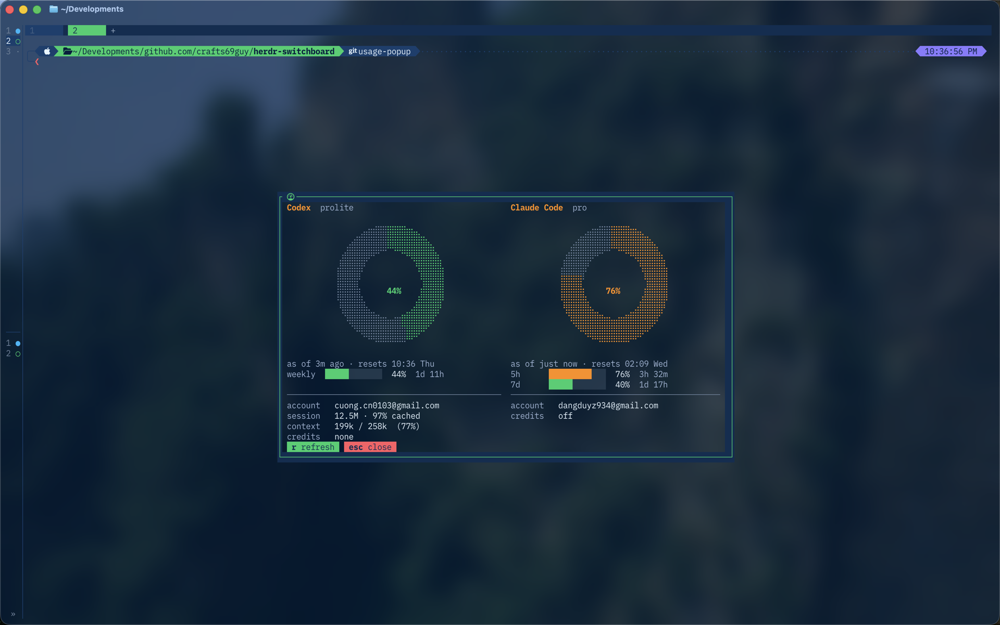

# herdr-switchboard

[](https://github.com/crafts69guy/herdr-switchboard/actions/workflows/ci.yml)
[](https://github.com/crafts69guy/herdr-switchboard/releases/latest)


[](LICENSE)

A fast, searchable command palette for [Herdr](https://herdr.dev): move between projects,
launch AI agents, recall commands, inspect ports, review Git changes, and focus a pane without
leaving the terminal.


## What it gives you

| Surface | Use it to |
| --- | --- |
| **Projects** | Jump to agents and workspaces, or open ghq repos and worktrees in a workspace, tab, split, or the current pane. |
| **AI Agents** | Start any installed Herdr AI integration in the current pane or a fresh target. |
| **Usage** | See how much of each AI subscription is spent, when it resets, and how old the reading is. |
| **Commands** | Search exact shell history and presets, then fill, run, copy, or forget a command. |
| **Ports** | Inspect live TCP listeners and safely act on their owner processes. |
| **Git** | Review the current repo with tuicr or hand it to lazygit. |
| **Zen** | Give one pane the screen, centred between optional dimmed gutters. |



Usage answers the question the others cannot: how much of each AI plan is left, and when it comes
back. Codex reads the exact figures OpenAI returns out of its own session log; Claude Code asks the
endpoint behind the in-session `/usage`. Every card names the account it reports on and dates its
own reading, because a stale percentage read as current is worse than no percentage at all.

Projects is a native Rust TUI built with ratatui and nucleo. Unlike
`ghq list | fzf | cd`, it understands live Herdr agents, workspaces, tabs, panes, and linked
worktrees. No fzf installation is required.

> [!NOTE]
> Switchboard is actively developed alongside Herdr's CLI and socket API. Pin a release when
> stability matters, and [report compatibility problems](https://github.com/crafts69guy/herdr-switchboard/issues).

> [!WARNING]
> Repository removal and Port TERM/KILL are destructive. Switchboard requires typed confirmation;
> process signals also revalidate the PID and process start identity before acting.

## Quick start

### Requirements

- [Herdr](https://herdr.dev) 0.8.0 or newer.
- [`ghq`](https://github.com/x-motemen/ghq) for Projects, Clone, and Git.
- Rust and `cargo` for linked development checkouts or as a fallback when a matching release
  binary cannot be downloaded.

Optional integrations are feature-scoped:

- [`tuicr`](https://github.com/agavra/tuicr) 0.20.0 or newer for Git review.
- [`gh`](https://cli.github.com) for the Git pull-request row.
- [`lazygit`](https://github.com/jesseduffield/lazygit) for staging and commits.
- [`eza`](https://github.com/eza-community/eza) for richer repository trees.

### Install and bind the menu

```sh
herdr plugin install crafts69guy/herdr-switchboard
```

Add a key to `~/.config/herdr/config.toml`:

```toml
[[keys.command]]
key = "prefix+space"
type = "plugin_action"
command = "switchboard.menu"
description = "Switchboard menu"
```

Reload Herdr, then press `prefix+space`:

```sh
herdr server reload-config
```

See [`examples/keybindings.toml`](examples/keybindings.toml) for direct picker, Git, Zen, Clone,
and forced-target bindings.

## Using the pickers

Pickers open ready to type. Press `esc` for Vim-style Normal mode, `i` or `/` to return to Insert
mode, and `?` at any time for the current live keymap. The footer also updates when bindings are
remapped.

Common Projects actions:

| Insert | Normal | Action |
| --- | --- | --- |
| `enter` | `enter` | Open the selected item using its default action. |
| `ctrl-t` | `t` | Open a repo or worktree in a new tab. |
| `ctrl-v` | `v` | Open it in a split. |
| `ctrl-o` | `o` | Open it in the current pane. |
| `alt-w` | `w` | Open it in a workspace. |
| `alt-p` | `p` | Toggle the preview. |
| `?` | `?` | Show the live cheatsheet. |

Mouse input is supported: the wheel scrolls the pane beneath it, and a click selects a row, group,
or command-bar action. See [Keybindings](docs/keybindings.md) for the complete Projects map and
mode-specific actions for Commands, Ports, AI Agents, and Zen.

## Actions

Bind the central menu or any action directly as a Herdr `plugin_action`:

| Action | Opens |
| --- | --- |
| `switchboard.menu` | The searchable central menu. |
| `switchboard.projects` | Agents, workspaces, ghq repos, and linked worktrees. |
| `switchboard.agents` | Installed AI integrations. |
| `switchboard.usage` | Subscription quota for your AI agents. |
| `switchboard.commands` | Shell history and configured presets. |
| `switchboard.ports` | Live TCP listeners and owner processes. |
| `switchboard.git` | The Git menu for the current repo. |
| `switchboard.zen` | A picker for choosing a pane to focus. |
| `switchboard.zen-toggle` | Zen-toggle the current pane without opening a picker. |
| `switchboard.settings` | Standalone Switchboard settings. |
| `switchboard.clone` | The ghq clone flow. |
| `switchboard.changelog` | Release notes with the installed version marked. |
| `switchboard.update` | The guarded tagged-release updater. |

The forced-target actions `switchboard.open-workspace`, `switchboard.open-tab`, and
`switchboard.open-split` open Projects with a fixed destination for `enter`.

## Configuration

Switchboard reads namespaced TOML from:

```sh
herdr plugin config-dir switchboard
```

Copy [`examples/config.toml`](examples/config.toml), invoke `switchboard.settings`, or press `alt-,`
inside Projects. Settings are drafted before being applied. Changes made inside Projects refresh
that picker immediately, without a relaunch or server reload.

Common settings include:

| Setting | Purpose |
| --- | --- |
| `common.keymode` | Start in `insert` or Vim-first `normal` mode. |
| `projects.default_target` | Use `workspace`, `tab`, `split`, or `pane` for `enter` on a repo. |
| `projects.default_tab` | Start on `all`, `agents`, `workspaces`, `repos`, or `worktrees`. |
| `projects.sort` | Sort the resting list by `recent`, `name`, or `kind`. |
| `projects.preview` | Enable or disable the preview card. |
| `commands.presets` | Add named commands with an origin or fixed cwd. |
| `zen.width` / `zen.scrim` | Control the focused pane and its gutters. |
| `zen.chrome` | Optionally hide Herdr pane chrome during a Zen session. |
| `usage.providers` | Which AI subscriptions the Usage popup reads, in display order. |
| `usage.warn_percent` / `usage.alert_percent` | Where a quota donut turns yellow, then red. |

The plugin reads only its namespaced config; legacy top-level keys are not accepted. See the
[configuration guide](docs/configuration.md) for every section, remapping, state paths, and update
behaviour.

## Guides

- [Features and safety](docs/features.md) — AI Agents, Commands, Ports, and confirmations.
- [Keybindings](docs/keybindings.md) — Insert/Normal modes and remapping.
- [Zen mode](docs/zen.md) — layout restoration, scrims, and `zen.chrome` trade-offs.
- [Git menu](docs/git-menu.md) — tuicr, pull requests, saved reviews, and lazygit.
- [Configuration](docs/configuration.md) — namespaced TOML and runtime settings.
- [Architecture and performance](docs/architecture.md) — launch flow, binaries, previews, and tracing.

## Contributing

```sh
git clone https://github.com/crafts69guy/herdr-switchboard
cd herdr-switchboard
herdr plugin link "$PWD"
herdr server reload-config
```

Before opening a pull request:

```sh
cargo fmt --check
cargo clippy --all-targets -- -D warnings
cargo test
bash tests/manifest_spec.sh
bash tests/update_guard_spec.sh
bash tests/bootstrap_spec.sh
bash tests/menu_handoff_spec.sh
```

User-visible changes need an entry under `CHANGELOG.md`'s `[Unreleased]` section. Do not bump
versions manually; `bin/release.sh` keeps `Cargo.toml`, the plugin manifest, release notes, and tags
in sync. See [`AGENTS.md`](AGENTS.md) for the full repository conventions.

## Changelog

Run `switchboard.changelog` or read [`CHANGELOG.md`](CHANGELOG.md). Managed installs can update
through `switchboard.update`; linked development checkouts are intentionally protected.

## License

MIT — see [`LICENSE`](LICENSE).
