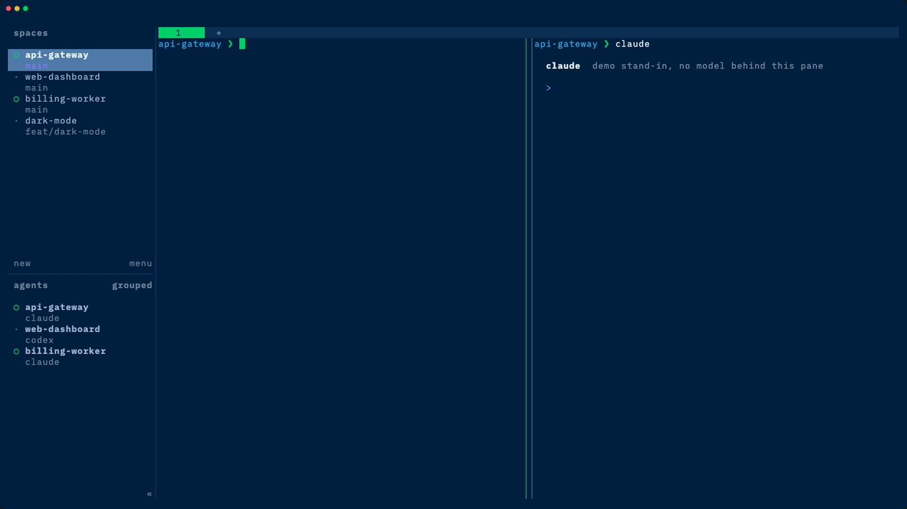
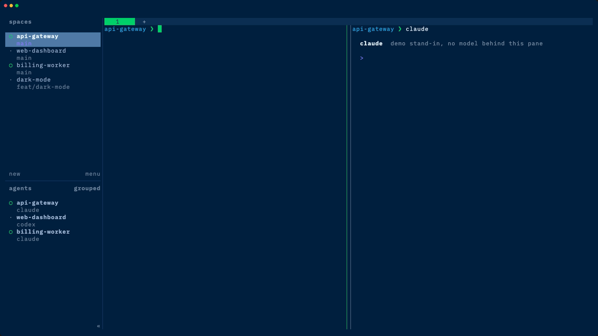
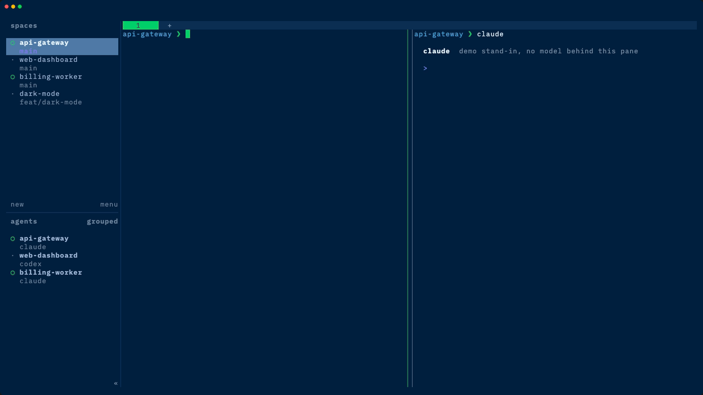
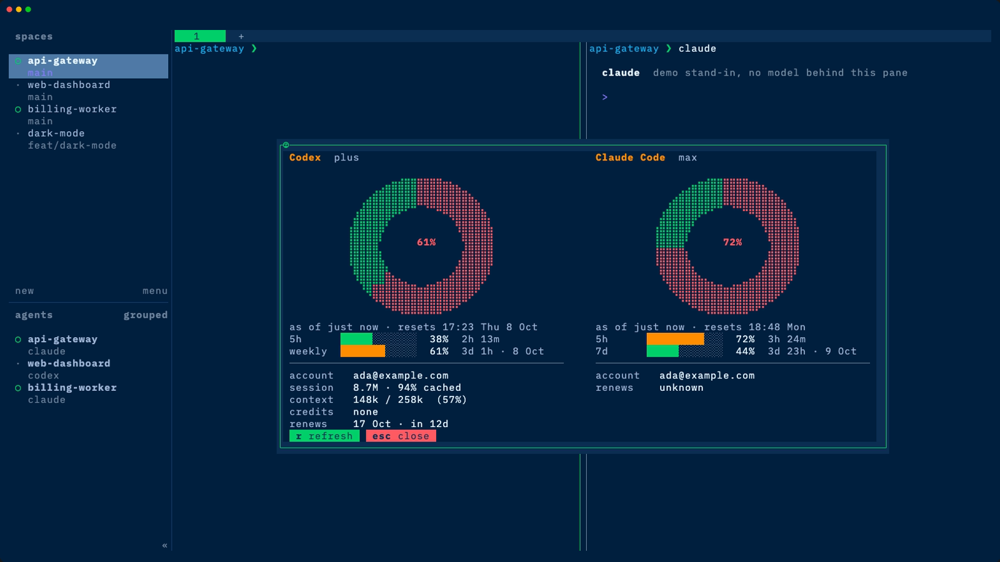

<h1 align="center">herdr-switchboard</h1>

<p align="center">
  <b>One key for everything you do between keystrokes in <a href="https://herdr.dev">Herdr</a>.</b><br>
  Jump to an agent, open a repo, recall a command, review a diff, check your AI quota — without
  leaving the terminal.
</p>

<p align="center">
  <a href="https://github.com/crafts69guy/herdr-switchboard/actions/workflows/ci.yml"></a>
  <a href="https://github.com/crafts69guy/herdr-switchboard/releases/latest"></a>
  
  
  <a href="LICENSE"></a>
</p>


Switchboard is a native Rust TUI (ratatui + nucleo) that lives inside Herdr. Unlike
`ghq list | fzf | cd`, it knows what Herdr knows — running agents, open workspaces, tabs, panes,
and linked worktrees — and every action lands exactly where you asked: a workspace, a tab, a
split, or the pane you were in. No fzf required.

## Contents

- [A tour](#a-tour)
- [Quick start](#quick-start)
- [Keys](#keys)
- [Actions](#actions)
- [Configuration](#configuration)
- [Guides](#guides)
- [Contributing](#contributing)

## A tour

> Every clip below is recorded from a disposable sandbox with invented repositories and stand-in
> agents — see [Recording the demos](#recording-the-demos).

### Projects — agents, workspaces, repos, and worktrees in one list

The clip above. Live agents and workspaces sit on top of every ghq repository and linked worktree,
grouped and counted in the Context column. The Inspector follows the selection: an agent's status,
a workspace's panes, a repo's branch, last commit, file tree, and README. Star the repositories you
live in, and `enter` does the right thing for each kind of row — focus an agent, switch to a
workspace, open a repo.

The layout adapts to the pane: Context, Navigator, and Inspector from 120 columns; Navigator and
Inspector from 80; Navigator alone below that.

### One menu for every surface



Bind a single key to `switchboard.menu` and everything else is a search away. Every entry also has
its own action if you would rather bind it directly.

### Commands — shell history and presets, filled not retyped



Searches zsh, Bash, or fish history together with your `[[commands.presets]]`. `enter` fills the
exact command into the pane you came from, `ctrl-enter` runs it, and `ctrl-s` stars it so it
survives falling out of history. Common credential patterns are dropped before anything is stored.

### Git — review the working tree with tuicr



A repo-local menu in its own pane: review the worktree, a branch, a commit range, a pull request,
or a merge conflict in [tuicr](https://github.com/agavra/tuicr), then hand saved review comments
to a running agent. Staging and commits go to lazygit. Quitting the tool returns you to the pane
you started in.

### Usage — how much of each AI plan is left



A quota card per subscription: every rate-limit window, when it resets, when the plan renews, and
which account it belongs to. Codex is read from its own session log; Claude Code asks the endpoint
behind its in-session `/usage`. Every card dates its own reading, because a stale percentage read
as current is worse than none.

### Zen — one pane, centred


`switchboard.zen-toggle` moves the current pane into a tab of its own, centred between two
gutters, without restarting its process — and puts it back where it was. With Herdr's Kitty
graphics enabled, the gutters are dimmed.

### And the rest

| Surface | What it does |
| --- | --- |
| **AI Agents** | Start any installed Herdr AI integration in the current pane, a new tab, or a new workspace. |
| **Ports** | Inspect live TCP listeners; open them over HTTP(S), or TERM/KILL the owner after revalidating the process. |
| **Node Versions** | Search local and remote Node.js versions and use, install, default, or remove them through fnm. |
| **Settings** | Edit every option in a drafted form, inside Projects (`alt-,`) or as its own popup. |
| **Clone** | `ghq get` from the clipboard or a prompt, then open the result. |
| **Changelog / Update** | Read release notes with your version marked; update a managed install in place. |

> [!WARNING]
> Repository removal and Ports TERM/KILL are destructive. Both require typed confirmation, and
> process signals revalidate the PID and its start identity before acting.

## Quick start

### Requirements

- [Herdr](https://herdr.dev) 0.8.0 or newer.
- [`ghq`](https://github.com/x-motemen/ghq) for Projects, Clone, and Git.
- Rust and `cargo` only for a linked development checkout, or as a fallback when a matching
  release binary cannot be downloaded.

Optional integrations light up their own feature:

| Tool | Enables |
| --- | --- |
| [`tuicr`](https://github.com/agavra/tuicr) 0.20.0+ | Git reviews. |
| [`gh`](https://cli.github.com) | The Git pull-request row. |
| [`lazygit`](https://github.com/jesseduffield/lazygit) | Staging and commits from the Git menu. |
| [`eza`](https://github.com/eza-community/eza) | Richer repository trees in the Inspector. |
| [`fnm`](https://github.com/Schniz/fnm) | Node Versions and opt-in per-project activation. |

### Install

```sh
herdr plugin install crafts69guy/herdr-switchboard
```

Bind the menu in `~/.config/herdr/config.toml`:

```toml
[[keys.command]]
key = "prefix+space"
type = "plugin_action"
command = "switchboard.menu"
description = "Switchboard menu"
```

Then reload Herdr and press `prefix+space`:

```sh
herdr server reload-config
```

[`examples/keybindings.toml`](examples/keybindings.toml) has ready-made bindings for Projects,
Git, Usage, Zen, Clone, and the forced-target openers.

> [!NOTE]
> Switchboard tracks Herdr's CLI and socket API closely. Pin a release when stability matters, and
> [report compatibility problems](https://github.com/crafts69guy/herdr-switchboard/issues).

## Keys

Pickers open in Vim-style Normal mode: `i` or `/` to type, `esc` to navigate. Set
`common.keymode = "insert"` to start typing straight away.

A modifier says what *kind* of thing a key does, never which mode you are in:

| Prefix | Meaning |
| --- | --- |
| `enter` | Run the selected row's primary action; `ctrl-enter` / `alt-enter` are its variants. |
| `ctrl-<key>` | Act on the selected row — open, copy, send, star, update, remove. |
| `alt-<key>` | Change the view or the app — preview, sort, clone, changelog, settings. |

Every chord means the same thing in both modes and on every picker. Normal mode adds bare-letter
aliases on the same letters (`e` for `ctrl-e`). The mouse works everywhere: the wheel scrolls what
is under it, a click selects, and a click on the selected row runs it.

Projects at a glance:

| Key | Action | Normal alias |
| --- | --- | --- |
| `enter` | Open the selection with its kind's default action. | |
| `ctrl-e` / `ctrl-v` / `ctrl-o` / `ctrl-w` | Open a repo or worktree in a tab / split / this pane / a workspace. | `e` `v` `o` `w` |
| `ctrl-y` / `ctrl-a` | Copy its absolute path / send it to a running agent as context. | |
| `ctrl-s` | Star or unstar a repo or worktree. | |
| `ctrl-r` / `ctrl-x` | Update a repo / remove a repo or linked worktree. | |
| `tab` / `shift-tab` | Move between All, Agents, Workspaces, Repos, Worktrees, and Starred. | `L` / `H` |
| `alt-p` / `alt-s` | Toggle the preview / cycle the sort. | `p` |
| `alt-l` / `alt-h` / `alt-,` | Clone / changelog / settings. | |
| `?` | The live cheatsheet, drawn from your current bindings. | |

Every picker's keys are remappable under `[keys.<picker>]`. See [Keybindings](docs/keybindings.md)
for the full map, the other pickers, and why `ctrl-b` is never bound.

Removing a worktree opens a confirmation popup and keeps the picker open afterwards. Type its
name to confirm; Force requires `force <name>` and discards local changes. Branch deletion is
optional and uses Git's merged-branch check. Locked worktrees must be unlocked separately.
Removal deletes the checkout, including ignored files; running panes and agents stay open and
may be affected by the missing directory.

## Actions

Bind the menu, or any surface directly, as a Herdr `plugin_action`:

| Action | Opens |
| --- | --- |
| `switchboard.menu` | The searchable central menu. |
| `switchboard.projects` | Agents, workspaces, ghq repos, and linked worktrees. |
| `switchboard.agents` | Installed AI integrations. |
| `switchboard.usage` | Subscription quota for your AI agents. |
| `switchboard.commands` | Shell history and configured presets. |
| `switchboard.ports` | Live TCP listeners and their owner processes. |
| `switchboard.fnm` | Installed and remote Node.js versions, through fnm. |
| `switchboard.git` | The Git menu for the current repo. |
| `switchboard.zen` | A picker for the pane to put in Zen. |
| `switchboard.zen-toggle` | Zen for the current pane, with no picker. |
| `switchboard.settings` | Standalone settings. |
| `switchboard.clone` | The ghq clone flow. |
| `switchboard.changelog` | Release notes with the installed version marked. |
| `switchboard.update` | The guarded tagged-release updater. |

`switchboard.open-workspace`, `switchboard.open-tab`, and `switchboard.open-split` open Projects
with `enter` fixed to that destination for repositories.

## Configuration

Switchboard reads namespaced TOML from the directory this prints:

```sh
herdr plugin config-dir switchboard
```

Start from [`examples/config.toml`](examples/config.toml), or edit live with `switchboard.settings`
or `alt-,` inside Projects — changes are drafted, validated, and applied without a relaunch.

| Setting | Purpose |
| --- | --- |
| `common.keymode` | Start in `normal` (default) or `insert` mode. |
| `common.transparency` | Let the terminal background show through, or fill panels opaquely. |
| `projects.default_target` | Where `enter` opens a repo: `workspace`, `tab`, `split`, or `pane`. |
| `projects.default_tab` / `projects.sort` | The starting group, and `recent`, `name`, or `kind` order. |
| `commands.presets` | Named commands with an origin or fixed cwd. |
| `usage.providers` | Which AI subscriptions Usage reads, in display order. |
| `zen.width` / `zen.scrim` / `zen.chrome` | The focused pane's share, dimmed gutters, and optional hidden Herdr chrome. |
| `fnm.enabled` | Show and activate each project's Node version through fnm. |

Unknown keys are rejected rather than ignored. The [configuration guide](docs/configuration.md)
covers every section, remapping, state paths, and update behaviour.

## Guides

- [Features and safety](docs/features.md) — Usage, AI Agents, Commands, Ports, Node Versions, and
  confirmations.
- [Keybindings](docs/keybindings.md) — the prefix concept, every picker, and remapping.
- [Git menu](docs/git-menu.md) — tuicr reviews, pull requests, saved reviews, and lazygit.
- [Zen mode](docs/zen.md) — layout restoration, scrims, and `zen.chrome` trade-offs.
- [Configuration](docs/configuration.md) — namespaced TOML and runtime settings.
- [Architecture and performance](docs/architecture.md) — module seams, terminal lifecycle, and
  effects.

## Contributing

```sh
git clone https://github.com/crafts69guy/herdr-switchboard
cd herdr-switchboard
herdr plugin link "$PWD"
herdr server reload-config
```

Before opening a pull request, run the full gate:

```sh
bash bin/check.sh
```

User-visible changes add a line under `CHANGELOG.md`'s `[Unreleased]` section. Do not bump
versions by hand — `bin/release.sh` keeps `Cargo.toml`, the plugin manifest, release notes, and
tags in sync. [`AGENTS.md`](AGENTS.md) has the full repository conventions.

### Recording the demos

The clips in this README are [VHS](https://github.com/charmbracelet/vhs) tapes in
[`demo/tapes`](demo/tapes), rendered into [`docs/media`](docs/media):

```sh
bash demo/render.sh            # every take
bash demo/render.sh projects   # just one
```

Each take runs against a throwaway sandbox built by [`demo/sandbox.sh`](demo/sandbox.sh): its own
`$HOME`, its own Herdr server, invented repositories, seeded shell history, stand-in agents, and
canned quota readings. Nothing from the recording machine can reach a frame. It needs `vhs`,
`ttyd`, `ffmpeg`, a C compiler, and the BlexMono Nerd Font.

## Changelog

Run `switchboard.changelog` or read [`CHANGELOG.md`](CHANGELOG.md). Managed installs update through
`switchboard.update`; linked development checkouts are deliberately left alone.

## License

MIT — see [`LICENSE`](LICENSE).
