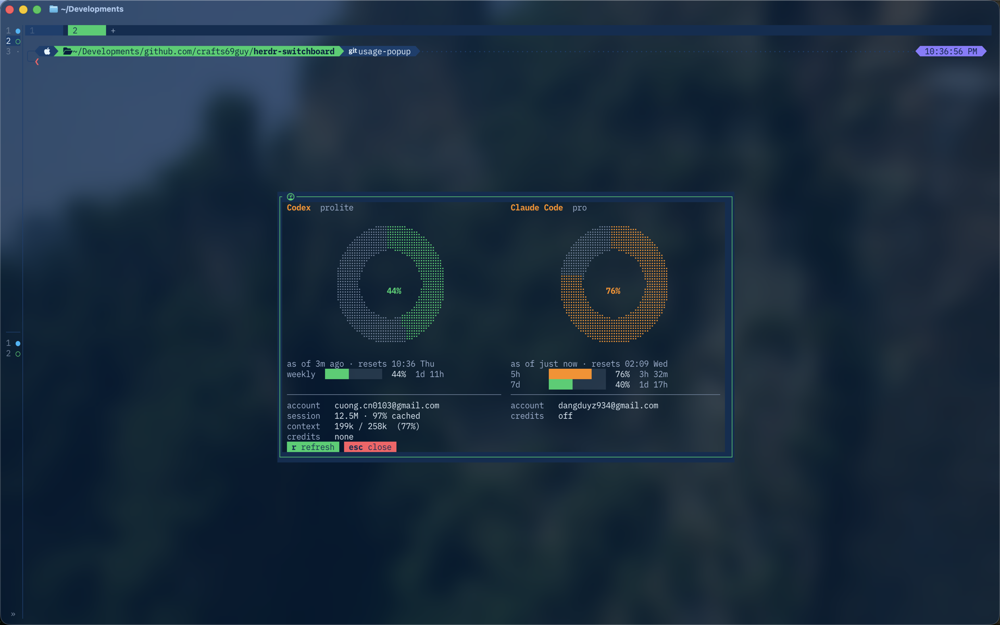

# herdr-switchboard

[](https://github.com/crafts69guy/herdr-switchboard/actions/workflows/ci.yml)
[](https://github.com/crafts69guy/herdr-switchboard/releases/latest)


[](LICENSE)

A fast terminal control surface for [Herdr](https://herdr.dev): move between projects,
launch AI agents, recall commands, inspect ports, review Git changes, and focus a pane without
leaving the terminal.

## What it gives you

| Surface | Use it to |
| --- | --- |
| **Projects** | Jump to agents and workspaces, or open ghq repos and worktrees in a workspace, tab, split, or the current pane. |
| **AI Agents** | Start any installed Herdr AI integration in the current pane or a fresh target. |
| **Usage** | See how much of each AI subscription is spent, when it resets, when it renews, and how old the reading is. |
| **Commands** | Search shell history and presets, star local favorites, then fill, run, copy, or forget a command. |
| **Ports** | Inspect live TCP listeners and safely act on their owner processes. |
| **Node Versions** | Search local and remote Node.js versions, then use, install, default, or remove them through fnm. |
| **Git** | Review the current repo with tuicr, send saved feedback to a running agent, open a merge conflict, or hand it to lazygit. |
| **Zen** | Give one pane the screen, centred between optional dimmed gutters. |



Usage answers the question the others cannot: how much of each AI plan is left, and when it comes
back. Codex reads the exact figures OpenAI returns out of its own session log; Claude Code asks the
endpoint behind the in-session `/usage`. Every card names the account it reports on and dates its
own reading, because a stale percentage read as current is worse than no percentage at all.

Projects is a native Rust TUI built with ratatui and nucleo. Unlike
`ghq list | fzf | cd`, it understands live Herdr agents, workspaces, tabs, panes, and linked
worktrees. No fzf installation is required.

> [!NOTE]
> Switchboard is actively developed alongside Herdr's CLI and socket API. Pin a release when
> stability matters, and [report compatibility problems](https://github.com/crafts69guy/herdr-switchboard/issues).

> [!WARNING]
> Repository removal and Port TERM/KILL are destructive. Switchboard requires typed confirmation;
> process signals also revalidate the PID and process start identity before acting.

## Quick start

### Requirements

- [Herdr](https://herdr.dev) 0.8.0 or newer.
- [`ghq`](https://github.com/x-motemen/ghq) for Projects, Clone, and Git.
- Rust and `cargo` for linked development checkouts or as a fallback when a matching release
  binary cannot be downloaded.

Optional integrations are feature-scoped:

- [`tuicr`](https://github.com/agavra/tuicr) 0.20.0 or newer for Git review.
- [`gh`](https://cli.github.com) for the Git pull-request row.
- [`lazygit`](https://github.com/jesseduffield/lazygit) for staging and commits.
- [`eza`](https://github.com/eza-community/eza) for richer repository trees.
- [`fnm`](https://github.com/Schniz/fnm) for the Node Versions manager and opt-in project activation.

### Install and bind the menu

```sh
herdr plugin install crafts69guy/herdr-switchboard
```

Add a key to `~/.config/herdr/config.toml`:

```toml
[[keys.command]]
key = "prefix+space"
type = "plugin_action"
command = "switchboard.menu"
description = "Switchboard menu"
```

Reload Herdr, then press `prefix+space`:

```sh
herdr server reload-config
```

See [`examples/keybindings.toml`](examples/keybindings.toml) for direct picker, Git, Zen, Clone,
and forced-target bindings.

## Using the pickers

Pickers open in Vim-style Normal mode. Press `i` or `/` to filter and `esc` to return to Normal;
set `common.keymode = "insert"` for a type-first start. Projects shows its live keymap with `?`,
and every picker derives its footer caps from the same chord parser used for input.

A prefix says what kind of thing a key does, not which mode you are in: **`ctrl` acts on the
selected row**, **`alt` changes the view or the app**, and `enter` runs the row's primary action.
Every chord means the same thing in both modes and on every picker. Normal adds bare aliases on the
same letters, and motion keeps the idiom of its mode.

The Projects Picker adapts without changing state: wide panes show Context, Navigator, and
Inspector; medium panes keep Navigator and Inspector; compact panes prioritize Navigator and clear
hidden preview geometry so it cannot capture mouse input.

Common Projects actions:

| Key | Action | Bare, Normal only |
| --- | --- | --- |
| `enter` | Open the selected item using its default action. | |
| `ctrl-e` | Open a repo or worktree in a new tab. | `e` |
| `ctrl-v` | Open it in a split. | `v` |
| `ctrl-o` | Open it in the current pane. | `o` |
| `ctrl-w` | Open it in a workspace. | `w` |
| `ctrl-y` | Copy the selected Agent, Repo, or Worktree absolute path. | |
| `ctrl-a` | Share that path as context with a running agent. | |
| `ctrl-s` | Star or unstar the selected Repo or Worktree. | |
| `alt-p` | Toggle the preview. | `p` |
| `alt-l` / `alt-h` | Clone flow / changelog. | |
| `?` | Show the live cheatsheet. | |

Path actions use the full absolute path even when the Inspector abbreviates the home directory as
`~`. Workspace rows disable them because a workspace may contain several unrelated repositories.
Sending follows the saved-review handoff policy: use the origin agent when it shares the worktree,
otherwise choose a matching promptable agent, falling back to all running agents.

Mouse input is supported on every surface: the wheel scrolls the pane beneath it, a click selects
a row, group, or command-bar action, and a click on the row already selected runs it. See
[Keybindings](docs/keybindings.md) for the complete Projects map and mode-specific actions for
Commands, Ports, AI Agents, and Zen.

## Actions

Bind the central menu or any action directly as a Herdr `plugin_action`:

| Action | Opens |
| --- | --- |
| `switchboard.menu` | The searchable central menu. |
| `switchboard.projects` | Agents, workspaces, ghq repos, and linked worktrees. |
| `switchboard.agents` | Installed AI integrations. |
| `switchboard.usage` | Subscription quota for your AI agents. |
| `switchboard.commands` | Shell history and configured presets. |
| `switchboard.ports` | Live TCP listeners and owner processes. |
| `switchboard.fnm` | Installed and remote Node.js versions managed through fnm. |
| `switchboard.git` | The Git menu for the current repo. |
| `switchboard.zen` | A picker for choosing a pane to focus. |
| `switchboard.zen-toggle` | Zen-toggle the current pane without opening a picker. |
| `switchboard.settings` | Standalone Switchboard settings. |
| `switchboard.clone` | The ghq clone flow. |
| `switchboard.changelog` | Release notes with the installed version marked. |
| `switchboard.update` | The guarded tagged-release updater. |

The forced-target actions `switchboard.open-workspace`, `switchboard.open-tab`, and
`switchboard.open-split` open Projects with a fixed destination for `enter`.

### Node Versions

Open **Node Versions** from the central menu or invoke `switchboard.fnm` directly. Installed
versions appear immediately while `fnm list-remote` loads in the background. Search normally or
use `source:installed`, `source:remote`, `status:current`, and `status:default` filters.

| Key | Action |
| --- | --- |
| `enter` | Use an installed version in the origin pane, or install a remote version. |
| `ctrl-enter` | Use the selected installed version. |
| `alt-enter` | Install the selected remote version. |
| `ctrl-d` | Make an installed version the fnm default. |
| `ctrl-x` | Uninstall after typing the exact version to confirm. |
| `alt-r` | Refresh local and remote versions. |

## Configuration

Switchboard reads namespaced TOML from:

```sh
herdr plugin config-dir switchboard
```

Copy [`examples/config.toml`](examples/config.toml), invoke `switchboard.settings`, or press `alt-,`
inside Projects. Settings are drafted before being applied. Changes made inside Projects refresh
that picker immediately, without a relaunch or server reload.

Common settings include:

| Setting | Purpose |
| --- | --- |
| `common.keymode` | Start in Vim-first `normal` (default) or type-first `insert` mode. |
| `projects.default_target` | Use `workspace`, `tab`, `split`, or `pane` for `enter` on a repo. |
| `projects.default_tab` | Start on `all`, `agents`, `workspaces`, `repos`, `worktrees`, or `starred`. |
| `projects.sort` | Sort the resting list by `recent`, `name`, or `kind`. |
| `projects.preview` | Enable or disable the preview card. |
| `fnm.enabled` | Show and activate project Node versions through an installed fnm. |
| `commands.presets` | Add named commands with an origin or fixed cwd. |
| `zen.width` / `zen.scrim` | Control the focused pane and its gutters. |
| `zen.chrome` | Optionally hide Herdr pane chrome during a Zen session. |
| `usage.providers` / `usage.timeout_ms` | Which AI subscriptions the Usage popup reads, and how long the networked one may take. |
| `usage.warn_percent` / `usage.alert_percent` | Where an ungraded quota bar turns yellow, then red. |

The plugin reads only its namespaced config; unknown top-level keys are not accepted. See the
[configuration guide](docs/configuration.md) for every section, remapping, state paths, and update
behaviour.

## Guides

- [Architecture and performance](docs/architecture.md) — module seams, terminal lifecycle,
  responsive layout, effects, and tracing.
- [Features and safety](docs/features.md) — Usage, AI Agents, Commands, Ports, Node Versions, and confirmations.
- [Keybindings](docs/keybindings.md) — Insert/Normal modes and remapping.
- [Zen mode](docs/zen.md) — layout restoration, scrims, and `zen.chrome` trade-offs.
- [Git menu](docs/git-menu.md) — tuicr, pull requests, saved reviews, and lazygit.
- [Configuration](docs/configuration.md) — namespaced TOML and runtime settings.

## Contributing

```sh
git clone https://github.com/crafts69guy/herdr-switchboard
cd herdr-switchboard
herdr plugin link "$PWD"
herdr server reload-config
```

Before opening a pull request:

```sh
bash bin/check.sh
```

User-visible changes need an entry under `CHANGELOG.md`'s `[Unreleased]` section. Do not bump
versions manually; `bin/release.sh` keeps `Cargo.toml`, the plugin manifest, release notes, and tags
in sync. See [`AGENTS.md`](AGENTS.md) for the full repository conventions.

## Changelog

Run `switchboard.changelog` or read [`CHANGELOG.md`](CHANGELOG.md). Managed installs can update
through `switchboard.update`; linked development checkouts are intentionally protected.

## License

MIT — see [`LICENSE`](LICENSE).
